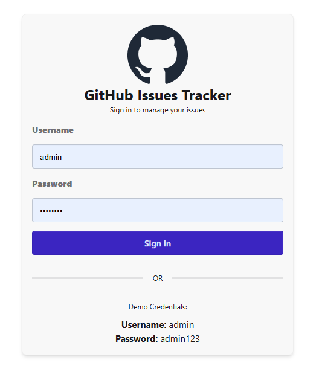
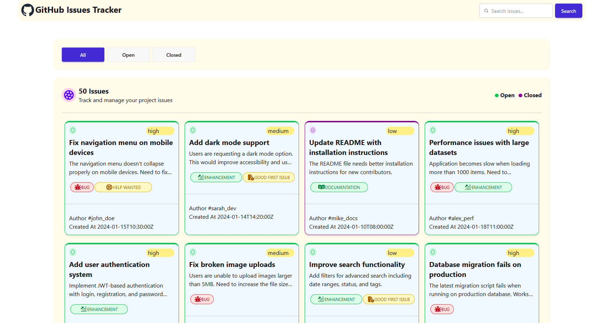

# 🌟 GitHub Issues Tracker

## 🔗 Live Demo (Netlify)

👉 [View Live Project -> GitHub Issues Tracker](https://github-issue-tracker-by-simanto.netlify.app/)

---

## 📖 Overview

The **GitHub Issues Tracker** is a responsive web application that fetches and displays issue data from a REST API. It includes a functional login page, a main dashboard to view all issues, and features like filtering by status (Open/Closed), searching, and viewing detailed information through interactive modals.

## 🖼️ Home Page Preview

Sign in page
Home page

## 🛠️ Technologies Used

* **HTML5:** For structuring the application.
* **CSS3:** (Vanilla / Tailwind / DaisyUI) For styling and responsive design.
* **Vanilla JavaScript (ES6+):** For DOM manipulation, API fetching, and logical operations.
* **Fetch API:** For making asynchronous HTTP requests to the backend server.

## ✨ Main Features

* **Authentication:** A styled login page with default admin credentials.
* **Dynamic Data Fetching:** Loads issue data dynamically from the provided API.
* **Categorization (Tabs):** Filter issues easily using "All", "Open", and "Closed" tabs.
* **Interactive UI:**
  * Visual indicators for issue status (Green top border for Open, Purple for Closed).
  * Active state styling for selected category buttons.
  * Loading spinner during API data fetching.
* **Search Functionality:** Instantly search through issues using keywords.
* **Detail Modals:** Click on any issue card to view full details in a pop-up modal.
* **Fully Responsive:** Optimized for both mobile and desktop views.

## 📦 Dependencies

This project uses CDN-based libraries:

* Tailwind CSS  
* DaisyUI  
* Font Awesome  

(No package installation required)

### 🚀 How to Run Locally

Follow these simple steps to set up the project on your computer:

* **Step 1: Clone the Project** First, you need to get the code on your computer. Open your terminal or command prompt and run the `git clone` command with the repository link.

* **Step 2: Enter the Folder** Once the download is finished, go inside the project folder using the `cd` command.

* **Step 3: Open the Project** Since this is a simple web project, you don't need to install anything special.
  * If you use **VS Code**, just right-click on the `index.html` file and select **"Open with Live Server"**.
  * Alternatively, you can simply find the `index.html` file in your folder and **double-click** it to open it in any browser (like Chrome or Brave).

* **Step 4: Internet Connection** Make sure you are connected to the internet. The project uses an external API and CSS libraries that need a connection to load properly.

* **Step 5: Sign In** On the login page, use the demo credentials to enter the main dashboard:
    > **Username:** `admin`  
    > **Password:** `admin123`
___